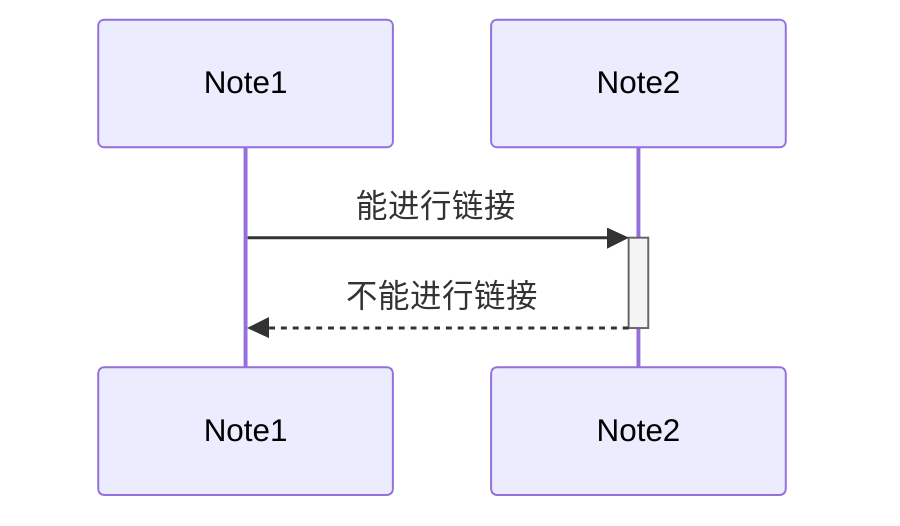

[[Garrett（Wyatt）]]
图文版： https://wws.lanzoui.com/i4QOCt0plxi 

# 通过Obsidian与卢曼卡片盒对笔记优化的心得
**初稿**：Garrett         
**审稿**：邬衍战友，魏崇鹏.战友，清浅战友，弍肆战友，zhen战友
大家好！
我是**Garrett**，在浪前一周啦！！！最近会有很多战友问我是怎么记笔记，恰巧在读《卡片笔记写作法》，也在使用Obsidian，想结合这二者，谈一谈自己关于笔记的一些看法
强烈推荐大家去知乎看一下老王关于笔记的回答！
->[(4 封私信 / 66 条消息) 有哪些让你相见恨晚的记笔记方法？ - 知乎 (zhihu.com)](https://www.zhihu.com/question/324766011/answer/1614038021)
声明：这篇文章是我从**参加浪前预备营**和**自己的角度**出发写的关于笔记的分享与思考，某些想法难免与老王有些重复，我会**标注**出来，但我不是二道贩子（五六七八道贩子）！！！

![[QQ图片20210723064432.jpg]]
# 01问题
和战友讨论的时候，有人会提到自己记笔记会有问题，大致分为一下两类
>1. 记录速度跟不上
>2. 思路不够清晰，感觉抓不住结构

->针对第一个问题，先看自己的工具（纸笔还是软件），然后练习书写速度或者打字速度，没必要羡慕记录速度快的战友而产生一些焦虑，这些都是老王说过的**自然价值**，只要你投入相应的时间，你也会获得相应的能力。
```md
时间的自然价值：随着时间流逝的自带的价值
（靠时间熬出来的，同样的环境里时间到了，几乎人人都会有这些价值。）
时间的人为价值：是靠人搞出来的，你自己通过选择获得的价值。
（比如大学里获奖的经历，积攒的真正高质量的人脉的经历）
```
->针对第二个问题，应当思考指导你记笔记这一行为的想法是什么，想法背后的思维又是什么，既然行动的结果不如人意，一定是某一环节出了问题（详见[[20210720成长核心思维第二讲]]）
今天着重分享我对背后**思维**的看法，对应的可以给一些小伙伴提供思路
>不知你是否总想上课时把笔记记得面面俱到呢？

这是一个常见的误区啦，下面我会用**流程意识**这一思维来分析这个误区。
（要是实在想记录完完全全的战友可以启用**回放大法**）
# 02流程意识
对于《卡片笔记写作法》这本书，我最喜欢的一个意识就是**流程意识**
```md
书中对于流程意识的看法：
1.考虑的是写作的总体流程
2.具有优秀结构的笔记是你可以信任的写作宝库
3.如果你能信任笔记，就不必用大脑记住所有东西，
从而可以去集中精神去思考重要的东西。（精力，注意力是有限的）
4.应该构建自己的工作流程，让洞见和新想法成为推荐我们前进的驱动力。
```
而**流程意识**不是局限于写作的，当你在浪前学习的时候，不妨这样去想：
你每天的总体流程是
>接受知识——>总结知识——>吸收知识

笔记记录**只是**接受知识到总结知识中的==一项工作==，它可能没你想得那么重要，真正的笔记是要**嵌入**到工作的流程中去，作为一种工具来辅助你记录，理解。重点仍是**流程**
那么，当你懊恼自己没有跟上笔记记录的时候，当你焦虑为什么群里总有人分享比你更全的笔记的时候，你不妨再多问自己一句——我理解了多少课程内容
这可不是转移注意力，因为在[[流程意识]]中，把流程按部就班的走下来是为了**最终结果**
那你为什么就一定相信笔记记得全得同学课堂吸收效果比你好呢？要是他因为忙于记录而真正得思考时间变少了呢？人的精力总是有限的嘛！所以焦虑是万万不可的。
而用流程意识去思考的话，我们会得出一个我们早已看到过千百遍的结论
>笔记不要啥啥都记

这个道理很简单且常见嘛！就像勾画重点，满书都勾画了重点，这本书就相当于没有重点，对于记录笔记也是一样的。尤其是对于结构抓不牢的战友，在课上可以重点先记录老王或者其他学长们**语气加重，重复几次，或者前面冠以第一点第二点**的话，而且这些话也不是毫无征兆地出现，一般学长们都会**下面我会从xxx方面开始说明***，这个时候，就要集中注意力啦！如果写的慢也不要害怕，因为每次抛出来重要的观点之后，都会举出一些类比的例子，这些例子是帮助你理解的，可以只记录概要或者不记录，一边听一边记录前面的**中心论点**，具体的老王的知乎分享也很全面，可以参考，这里就不赘述了。

当你明晰了流程意识，这一思维会或多或少地改变你对笔记的看法从而改变行动。记住：**结构**和**理解**放在首位，里面的内容如果暂时记录速度跟不上，可以参照每天群里战友的分享，或是启用回放大法！
关于回放大法也是有技巧的！（老王教的嘿嘿嘿）
>听课过程中觉得哪里没跟上，就看一下**会议已经进行的时间**或者**自备秒表**，在本上记录相应的时间，以达到快速在回放中找到你最想听的内容。

好啦，至此，**流程意识**我就介绍完了

# 03建立笔记链接
当你逐步地记录好了你手里的笔记，下一步不可避免地就是归档了。如何归档又成了一个问题。
>1. 简单粗暴桌面摆放！
>2. 文件夹大类笼统分类！
>3. 使用笔记软件进行细致归类！

我们当然希望自己的笔记能形成一个**群体**，或者说，用逻辑分类来建立不同时间段记录的内容，用书中的话说，这是建立**笔记链**。实际上卢曼卡片盒技术是对笔记进行超文本处理。
```md
1.卢曼卡片盒技术是对笔记进行超文本处理
2.记笔记的工具与笔记本身同等重要
3.只有当所有相关的工作都互相链接形成一个整体，所有的瓶颈都被消除时，
才能发生显著的变化。（现状不会马上被改变）
```
### 笔记链有什么好处呢？
——>笔记链的好处就是，你只需要很少的注意力就能看到这些笔记之间的联系和全局，这是一个很好的，节省你注意力的办法。（人的注意力是有限的）
——>此外，笔记链条还产生**语境**，一条笔记只有在它的上下文语境中才会有价值，而**上下文不一定是他的出处**、
```md
以我举例，比如我在伴读输出的时候写过心智的笔记，写过思考的笔记，写过模式拼接能力的笔记，那么心智和思考就会成为模式拼接能力的“上文”，让“模式拼接能力”的出现是有根据，有道理的；同时“模式拼接能力又是心智和思考的”下文“，让这二者的作用更加直接，这些是书中没有的连接，或者说，隐形的链接。
```
——>并且，建立笔记链有助于我们拓宽思路，比如《卡片笔记写作法》中举了这样一个例子：
```md
书中举例：对看似不同的笔记建立链接，类似于我们在熟人社会中的弱链接，即想要寻求帮助的时候，可能没有找到最能给我们帮助的人，但是我们与他们对话，一定能够获得看待问题的全新角度
```
——>更重要的是，当你不同的笔记以同一**主题概述**进行链接的时候，你或许有时候会发现不同的时间段你对与同一个主题概述的笔记，或许会产生矛盾！而【矛盾】可能**是我们对一个问题思考得不够透彻的标志，或者相反，是我们过度地使用了【某种模式】** 
```md
老王课堂上讲过两个矛盾的观点：阿德勒和李笑来对于”选择“话题
的看法看似矛盾，但是我们发现矛盾之后去审视哪里出了问题，就会发现其实矛盾产生的原因是我们忽略了两人观点是基于同一事实，即我们思考得不够透彻
```
链接的过程，也是审视，比较的过程。


### 如何建立自己的笔记链？
这就不得不提到卢曼卡片盒笔记系统最为关键，也是最为基本的一点：**专注于事件的本身**，实际上，这一观点李笑来先生在《把时间当作朋友》这本书中也提到过，即**看待问题要关注事实**。

###### Q：为什么说要关注事件地本身？
A：因为笔记也好，课堂也好，说白了就是我们对于某种事情的看法，某种事件地解读，从中提取经验，所以可以认为，不同笔记的源头也许是相同事物（比如都是关于成功学，有的书从思维出发，有的书从行动出发，不绝对，但是归根结底本源是一样的），审视这些，就会获得新的思路，新的链接。

# 04笔记链接与Obsidian
来到浪前，就算我没有学到什么，我也会感谢老王让我了解到Obsidian这款软件，因为这款笔记软件，真是太牛逼了！！！
为什么说它牛逼呢？因为它是一个非常切实有效的工具让我进行笔记的**链接工作**。
**笔记链**：将不同时间记录的笔记通过软件的链接功能链接起来，从而达到让知识在笔记链上流动的效果。
### 反向链接功能
知乎上也有很多全面安利Obsidian的功能的，这里我想重点安利一下他的**双向链接功能**
>什么是单向链接？
```md
单向链接（one-way link）：是指链接到一个网页的超链接，
而没有相应链接到原来的网页。
```
单向链接示意图：

为了避免这一传统笔记系统地局限性，obsidian中有名为“反向链接”的功能。
#### 双向链接牛逼在哪？

双向链接：既可以是大的页面（Page），也可以是更小的单元（Block）。 所谓双向链接，就是当你做笔记时，增加笔记A→笔记B的链接后，软件会自动加上B→A的链接。我们只要能找到这两个笔记中的任何一个，就可以找到另外一个。让笔记不再成为孤岛，增加了发现的可能性。
牛逼就在于，依据**网络的六度分隔理论**，只要我们对笔记多建立双向关联，哪怕你的数据库中有几十亿条笔记，也能通过中间的6条笔记找到你要找的那条回忆不起来的笔记。

![[Pasted image 20210723094354.png]]
*双链笔记的优势在于关联卡片，让结构浮现，进而生成可以分享的文件（图中红虚线框出来的部分）。*
*PS:上述内容摘自[双向链接笔记软件从入门到精通 - 知乎 (zhihu.com)](https://zhuanlan.zhihu.com/p/348814980)*
##### 何谓反向链接？
实际上就是上图，打通了从Note2到Note1的过程，不仅可以通过A到B，也可以从B到A，实现反向链接
你可以这样想：==**双向奔赴总比单相思好一百倍吧（狗头）**==


Obsidian中的反向链接功能展示：

![[QQ图片20210723080412.png]]
###### *上图展示了如何使用Obsidian中的反向链接功能*
**可以通过此功能发现这些笔记被哪些笔记进行了链接，从而思考这篇笔记能继续链接哪些类型的笔记。**
或者说，这一功能可以清晰地想你展示目前建立起来的小链条，减少你的注意力分散（人的注意力是有限的），从而达到进一布思考的可能。

### 网状知识结构（ graph-view）
这个大家或许能感到熟悉，就是老王之前在直播伴读时候总会展示出来的炫酷网状图！
给大家展示一下我目前笔记形成的网状图：
![[QQ图片20210723081408.png]]
其工作原理就是通过你给笔记打上的**标签**进行系统地分类
```md
给笔记打上标签的方法： #加上文字（PS：#与文字之间不要用
空格，否则就变成了调整字号大小的模式了）
```

如果说双向链接功能为我们理出了单线笔记链的最简形式，那么网状知识结构让我们明确了对待同一主题下有哪些笔记链可以进行调用，整理，优化。

##### 下面说我个人感觉需要注意的点吧(供参考)
>1.同一个标签不要打的过多！！！！！！
一定要精简，慎重考虑应该用哪些标签标记眼前的笔记
>2.同一个文件也不要打上过多的标签

这能有效的避免你看你的网状图成为一团乱麻，哈哈哈
并且把鼠标轻触在圆点上，与它相连接的线会被==高亮标记==
就像这样：![[QQ图片20210723082350.png]]

# 05 最后
好啦，以上就是我对《卡片笔记写作法》与Obsidian笔记软件的一些看法，希望能帮助到uu们，也可以私聊深入交流！

此外，也向大家介绍另外两个最近正在学的笔记软件
### XMind
**江子南.战友**推荐，是一个做思维导图的软件，近乎无限期免费试用（会心一笑），觉得结构抓不住的uu可以试一试通过XMind来进行系统的规划思维导图。

### 幕布
**江子南.战友**推荐，幕布可以同做思维导图的同时插入图片！
### Anki
**本宝是玉.战友**推荐，类似于卡片笔记，个人感觉可以很好地解决《卡片笔记写作法》中**闪念笔记**的实践，也对平时记忆零散信息有帮助。（上手会有一些难度，但这肯定不会阻止uu们成长！）
学习Anki的文章：[(4 封私信 / 62 条消息) Anki 怎么用？ - 知乎 (zhihu.com)](https://www.zhihu.com/question/28335314)


未来可期，我是Garrett，我们一起成长。
