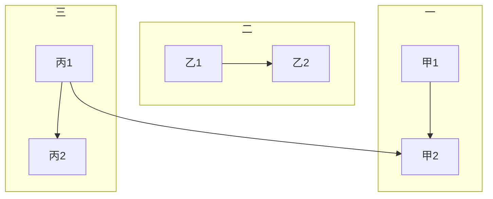

[[亮，有一计]] [[如何画流程图]] [[重点文章]]

```mermaid
graph LR;
    开始-->结尾;
    click 结尾 "Obsidian:///F:\Obsidian\obsidian%e7%be%a4%e5%88%86%e4%ba%ab\%e7%bb%93%e5%b0%be.md"
```

```mermaid
graph TB
    丙1-->甲2
    subgraph 一
    甲1-->甲2
    end
    subgraph 二
    乙1-->乙2
    end
    subgraph 三
    丙1-->丙2
    end
    click 一 "Obsidian:///F:\Obsidian\obsidian%e7%be%a4%e5%88%86%e4%ba%ab\%e4%b8%80.md"
	click 二 "Obsidian:///F:\Obsidian\obsidian%e7%be%a4%e5%88%86%e4%ba%ab\%e4%ba%8c.md"
	click 三 "Obsidian:///F:\Obsidian\obsidian%e7%be%a4%e5%88%86%e4%ba%ab\%e4%b8%89.md"
	click 甲1 "Obsidian:///F:\Obsidian\obsidian%e7%be%a4%e5%88%86%e4%ba%ab\%e7%94%b21.md"
	click 甲2 "Obsidian:///F:\Obsidian\obsidian%e7%be%a4%e5%88%86%e4%ba%ab\%e7%94%b22.md"
	click 乙1 "Obsidian:///F:\Obsidian\obsidian%e7%be%a4%e5%88%86%e4%ba%ab\%e4%b9%991.md"
	click 乙2 "Obsidian:///F:\Obsidian\obsidian%e7%be%a4%e5%88%86%e4%ba%ab\%e4%b9%992.md"
	click 丙1 "Obsidian:///F:\Obsidian\obsidian%e7%be%a4%e5%88%86%e4%ba%ab\%e4%b8%991.md"
	click 丙2 "Obsidian:///F:\Obsidian\obsidian%e7%be%a4%e5%88%86%e4%ba%ab\%e4%b8%992.md"
```

PS：
感觉熟悉一两个经常用的图，做[toc]替代物挺不错，做MOC也看着舒服
更复杂的时序图和甘特图等，尝试的时候中文遇到了其他问题，感觉需要js编程知识
更复杂的结构图，推荐用外部思维导图，加上Obsidian的笔记链接，效果也不错